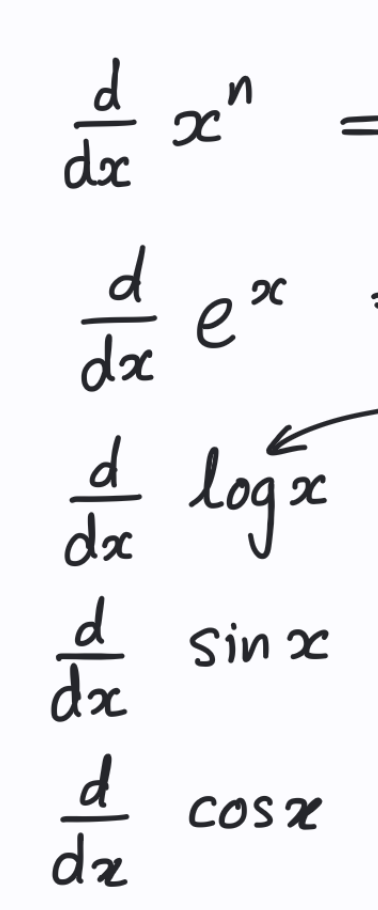

# do you need dx, how do you think about derivatives as differentials!?
- Whats d(x^2 - 1)?

# Derivative
- Mention the concept of the derivative mathematically and in plain english
- How do you think about derivatives as distances in x and y?
# General derivative
- Whats the derivative of each: 
- 
# Rules
- Whats the product rule in derivative?
  - Do you apply the product rule when say you have e^(x^2) * sin(y)? Why or why not?
- Whats the chain rule in derivative? 

# misconception happens to you sometimes:
- In derivatives, do you minus and then put the new power number or vice versa? you put the number first and then minus?
