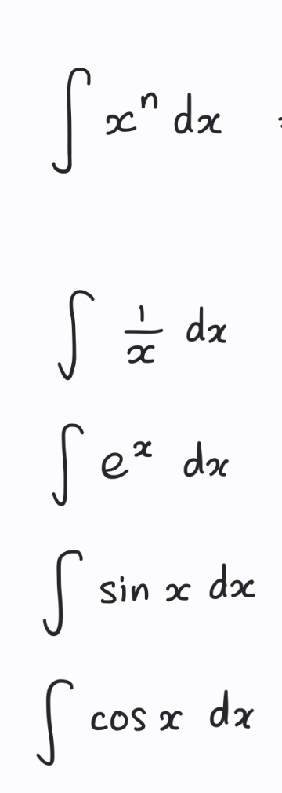

# Conceptual Questions
- Describe the concept of integation?
- Does integration tells you what happened at a point? What about derivatives?
- Why not use just the sum term in mathematics? why do we need to use a new term for integration?
- What does the answers of integration means? What does + C represents?
- How's integration related to differentation?
- Does integration always means the area under the curve?
- Why there's dx, dy in the integral?
- What does f(x) * dx means in the integral? How does this relate to the area?

# Integration Rules
- whats the integration of the following: 

# Integration methods

## Integration by subsitution
- How does integration by subsitution works? Mention step by step
- Whats the main goal of integration by subsitution that makes it work?
- When would you subsitute x with sin(u), cos(u)?

## Integration by parts
- When do you need to do integration by parts?
- How do you perform it?
- Misconception: Do you actually take the derivative when you say dg/dx or you take the function as it is? Do you take the derivative or the integral for g?
- Misconception: Do you do a cross multiplication to figure out whats inside the integral? or?
- What do you must do when there's logarithmic and you need to apply integration by parts?
- What do you do when there's a repeating patterns when you keep doing integration by parts?
- What do you do when you have sin^2(x) in the integral?

# Integration by subsitution and by parts
