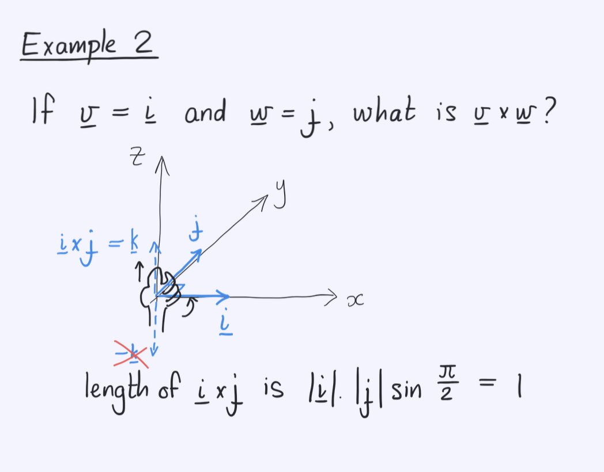
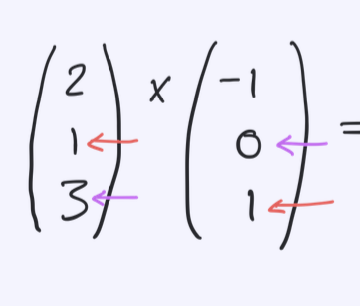

# Cross Product
- Whats a cross product? Whats the purpose of it?
- How do you calculate the length of the new vector using the angel?
- How do you apply the right hand rule to know the direction of the new vector?
- 
- 
- How can you find the cross product in vectors multiplication? Solve the following example: 
- Can u give me an example of how cross products are being used to find unrelated features in machine learning?
