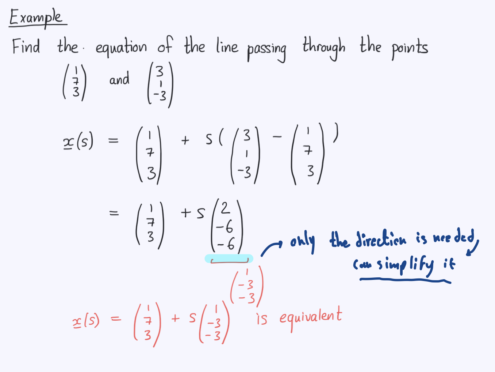
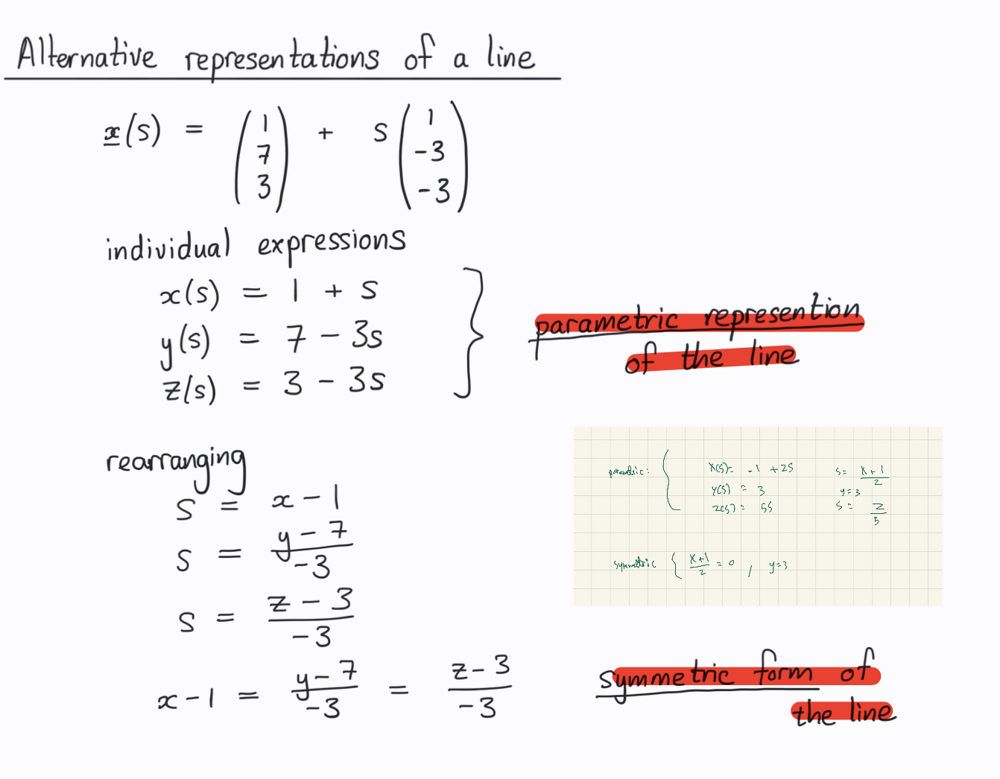
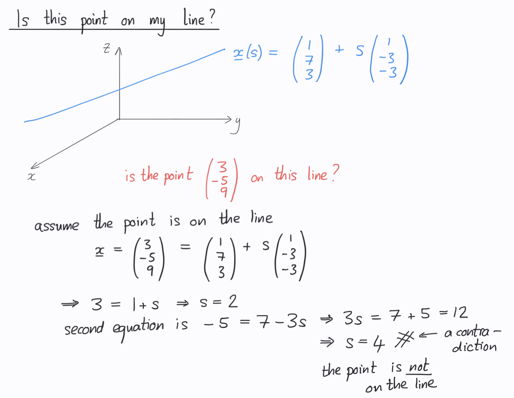
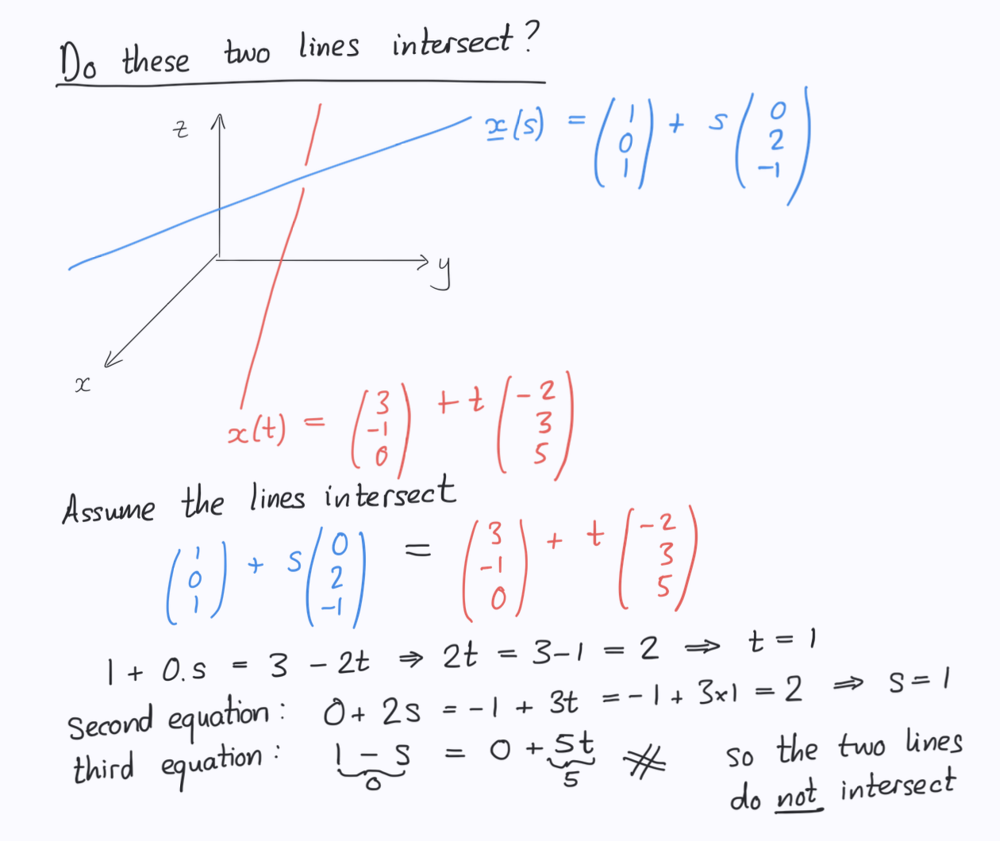

# Lines
- What are lines? Describe them mathematically
- Whats the vector equation of a line? Solve the following example: 
- Whats the parametric representation of a line?
- Whats the symmetric representation of a line? Whats the method to find it? Find the symmetric representation of the following example: 
- How can you figure out if a point is on your line? solve the following example: 
- How can you find of two lines intersects? Solve the following example: 
- How can you find minimum seperation between two lines?
- 
