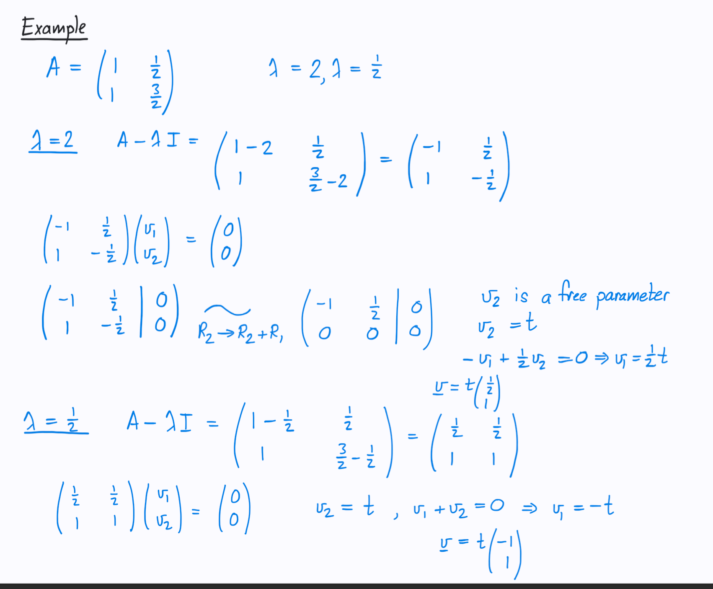

# Eigenvalues and vectors
- How do you calculate the eigenvalues when you reach to a format like ?
  - How can you find the first factor?
  - How can you quote coefficients and then solve?
- What are eigenvectors and eigenvalues?
- Does Eigenvalue represents the amount after the strech or before or in general or what exacytly/
- Whats the equation to find eigenvector and eigenvalues after a transformation
- Does changing the direction of a vector after a transformation discldoe the vector to become an eigenvector?
- What are the steps to find the eigenvalues and then eigenvectors?
- if you have , what does it mean that A transformation gives you two eigenvectors? Transformation on what exactly?
- How do you calculate the eigenvalues when you reach to a format like ? Mention step by step

## --------------------------------------------
- For eigenvalues and eigenvectors, you skippedd the section where it tells you how many eigenvectors depending on values and # of dimensions
- Skipped Diagonalisation
## --------------------------------------------