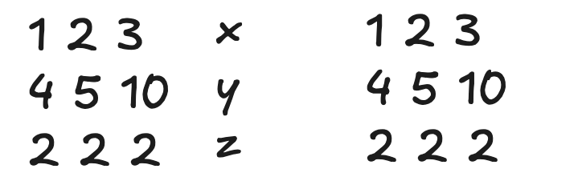

# General matrices
- Whats the difference between matrix multiplication, dot product and cross product?
- Whats the rule to multiply two matrices?
- Whats an upper triangle matrix?
- What does any matrix actually represents? 
- How can you define a vector using the length and the trig angle?
- say you have 5x+10y+2z, does this represents a plane? what if you have 5x+10y+2z = 10? 
- Whats the difference between the two things? 