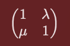

## Transformations
- How can you transform the matrix clockwise and anticlockwise?
- What are reflections? Whats a 2D matrix reflection looks like?
- What reflection is the following: 
- Whats dilation? 
- What does the follwoing matrix represents? 
- Whats shear?
- How can you apply shear on 2d and nD and what are the different ways you can?  and also 
- How can you project a vector into another vector?
- Find the projection of a into b from a = (4,3) and b = (1,2)?