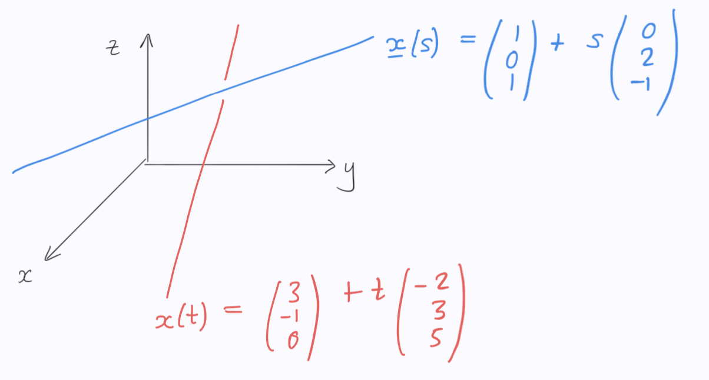

- Does anything bends in linear algebra? What about calculus?
- Where does calculus meets linear algebra? 
- Most of calculus and linear algebra is basically doing one thing, what is it?

# Difficult questions you forget usually
- How can you find a unit vector in the direction of a vector? What does this means really?
  - How can you find the unit vector of a general vector using cos of angels?
- Why do we use dot product? Whats the resulting scaler means? Can u give an example of this using LLMs architecture?
- How can you find the minimum seperation between two lines? Solve the following example: 

1. Vectors #Red
2. Dot product #Red
3. Cross product #Red
4. Lines #Red
5. Planes #Red
6. Systems of linear equation #Red
7. Matrices #Red