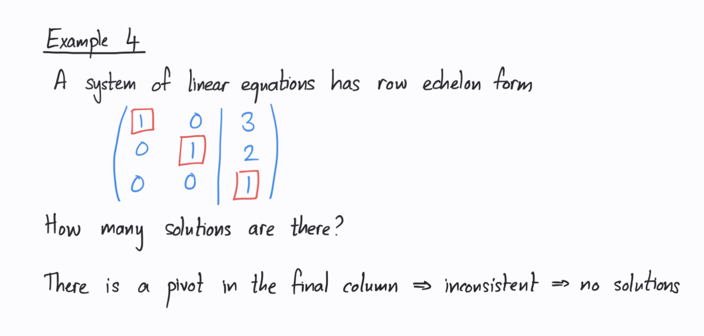

# Systems of linear equations
- What are systems of linear equations?
- What does it mean that a system of linear equations have a solution?
  - What are the type of solutions there are for systems of linear equations?
- Whats the purpose of finding the point of intersection for a system of linear equations?
- What does infinitely many solution looks like after you solve the equation?
- How can you relate matrices to neural networks?
- What does row echelon form means?
- What does reduced row echelon form means?
- What are pivots?
- How can pivots tells you if its a unique, infinite or no solutions?
- How can you turn an equation form to a parametric equation form?
- Should you always start from the bottom when solving linear equations?
- Can there are be multiple representing solutions to the same linear equation system?
- Why does this system doesnt have a solution? 
- Whats the difference between a overdetermined, determined and undetermined system? How can you figure out if a system is
- Whats rank, and how can you determine from rank if the system has solutions, no solutions or infinite amount of solutions?
- If you have free variables, does this mean its infinite solution, no solution or one solution?
- When we have free variables and its an infinite number of soltuions,  does x(s) = 5-2s and y(s) = 10+5s represents the same line? 
- When we have two free variables, what is the infinite number os olutions looks like? What about one free variable?

