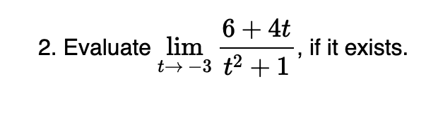
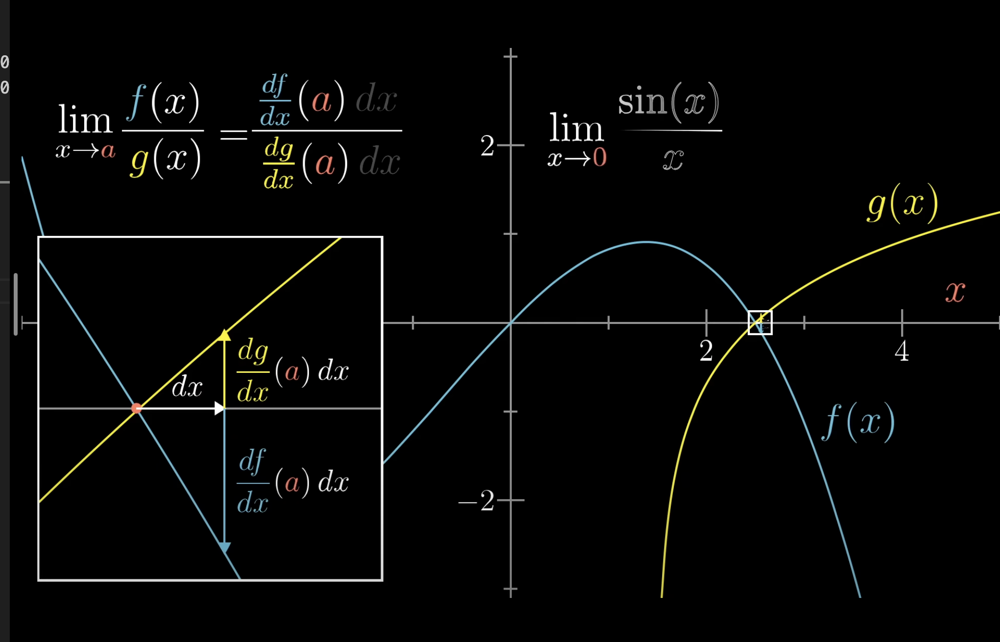

- What are the two forms that you need to use lhopitals rule? Do you need to use it for this one for example: 
- Whats Lhopitals rule? when do you use it?
- How do you use it?
- Explain the rule from this image: 