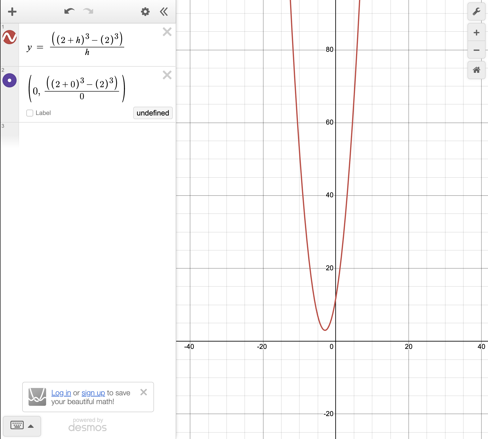

# Convergence and divergence
- Whats one of the main usages of limits?

# General limits knowledge
- What are limits? Whats the point of it?
- How do you find limits? Do you need to simplify the terms to the lowest?
- What are limits approaching from right and left?
- Does limit approaching from right and left always equal to limits approaching a value in general?
- I want you to explain the limits in terms of epsilon? 
- How can you relate limits to derivatives?
- Why division 0/0 is undefined?!
- Why does the graph here shows the value 12 although at x = 0, 12 is undefined!? 
- 
