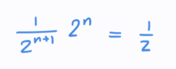
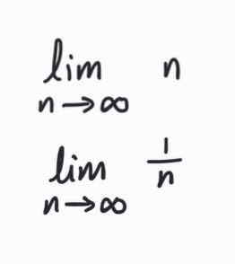
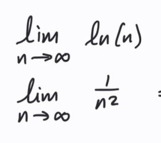
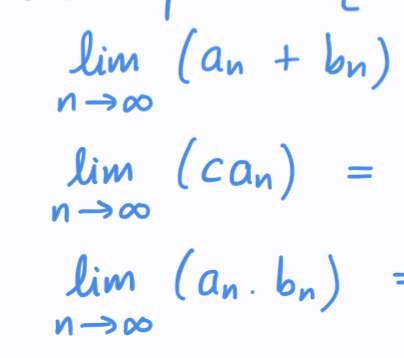

# Whats the main purpose of sequence and limits?
so basically, if the function is smooth, then I can approximate it using limits + sequence!
- Whats the sequence that results in e^a, e^x?
- 
# Sequences
- What's a sequence and an infinite sequence?
- Whats the difference between a series, sequence and a function?
- If a limit of a function diverges but not to a value, what does this mean? - When the limit doesn't exists?

# ConvergenceDivergence
- What does diverges means?
- What does converges means?
- Whats a ratio test and why do we need it?
- How does this equal to half? 

# Series
- Whats A Series?

# Limits of defined functions
- Find the limits of the following:  and also this: 

# Arthimetric properties of sequences
- When are you allowed to add two sequences? and multiply two sequences?
- When are you allowed to multiply by a constant to a sequence limit?
- Solve the following: 
- 