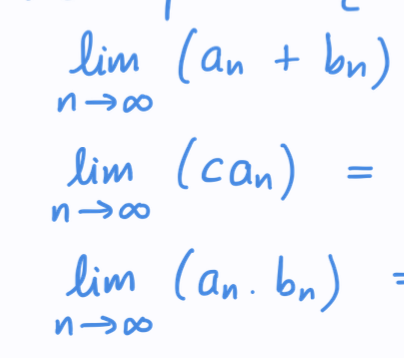

# Arthimetric properties of sequences
- When are you allowed to add two sequences? and multiply two sequences?
- When are you allowed to multiply by a constant to a sequence limit?
- Solve the following: 
