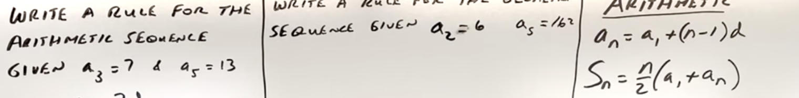
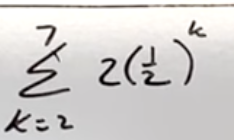
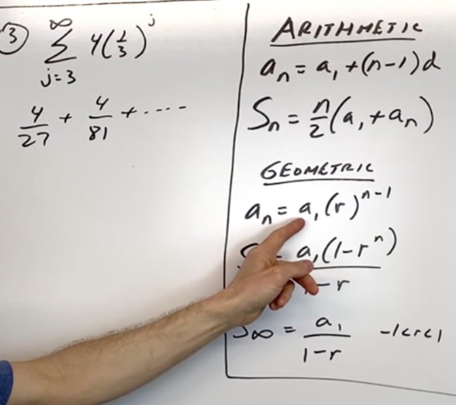
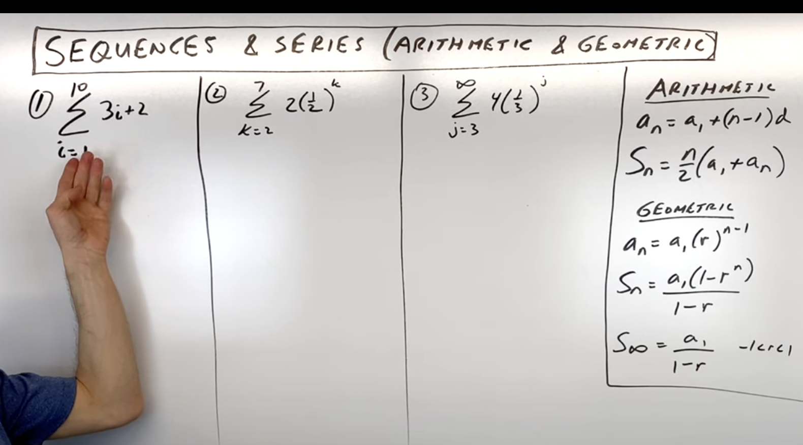

- Whats A Series?
- Whats the difference between an arithmetic and a geometric sequences?
- how can i know which series to use to find a specific summation?
- What does r represents in sequences and serieses?
- How do you solve something like this using the equation on the right? ?
- How can you find the formula to find any summation term and then represent it in a sigma nottion like the following: ![
- Whats the n term here? how many total terms do we have? 
- How do you deal with infinite summations? 
- 
- Solve those using the arithmetic and geometric series: 
- What does a represents in sequences and serieses?
- What does n represents in sequences and serieses?
- How do you usually represents sequences a_n ? do you use the previous term and so on? 
- There are two forms of writing a series? What are they?
- Whats the difference between series and a sequence?
- Is there only an infinite series or?
- What are the difference type of common serieses are there?
- 

- What happens when you factor the geometric series?