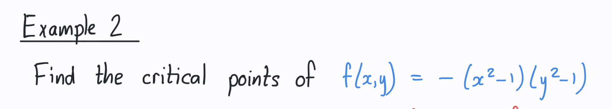

# Minimum, Maximum and Saddle
- for a function of a single variable, how do you find the local minimum/maximum?
- Whats the meaning of a stationary points?
- What are the three posibility for stationary points?
- Whats a saddle point?
- Whats the difference between stationary and critical points?
- How do you find stationary points?
- Find the critical points for this: 
  - Why cant we take (0,1) as a critical point?
- How do you know if a critical point is a min, max or saddle? For a single variable and multi?
- What if we found the Hussian matrix is bigger than 0, but then the second derivative of x is positive but the y derivative is negative? what would we consider this? ==> This wont happen if the function is smooth! 
- Is there a way you can find that the function is not smooth if one of the critical points neither min, max or saddle?
- Does it matter if you compute dxdy or dydx for hussian matrix? or both result is similar?
