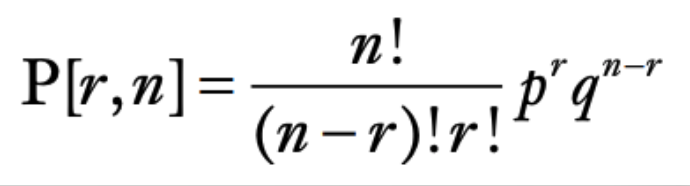
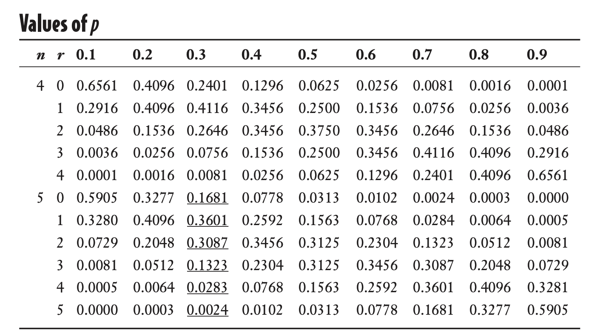

- Whats a trial?
- Whats the difference between a trial, event and random variables?
- Whats the input and output of a bionomial dist?
  - How to calculate it?
- why there's a table for bionomial distribtuion?
- Do you have to confir if the data follows a bionomial dist?

- How do you calculate the mean and std for a bionomial dist? What does they mean?