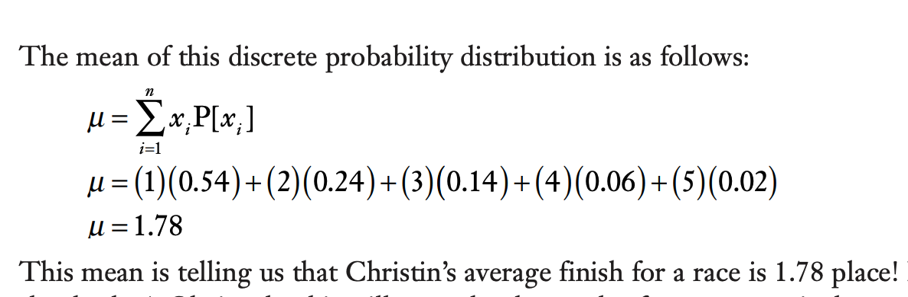
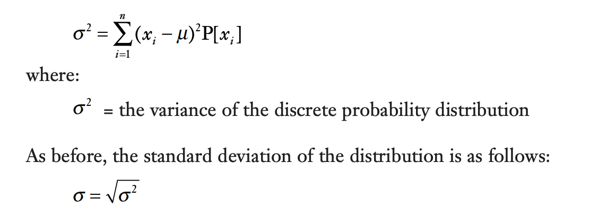

- Whats a discrete probability distribution?
- How's it related to random variables?
- When to use relative frequences and when to use the actual probabilties when construction a probability distribution?
**- Whats the difference between a continous and a discrete prob distribution?**

# How to calculate the mean of a discrete probability distribution?
what does the mean tells you on a discrete probability dist?

# How to calculate the variance/std of a discrete probability dist?
what does the standard deviation tells us on discrete probability dist?
