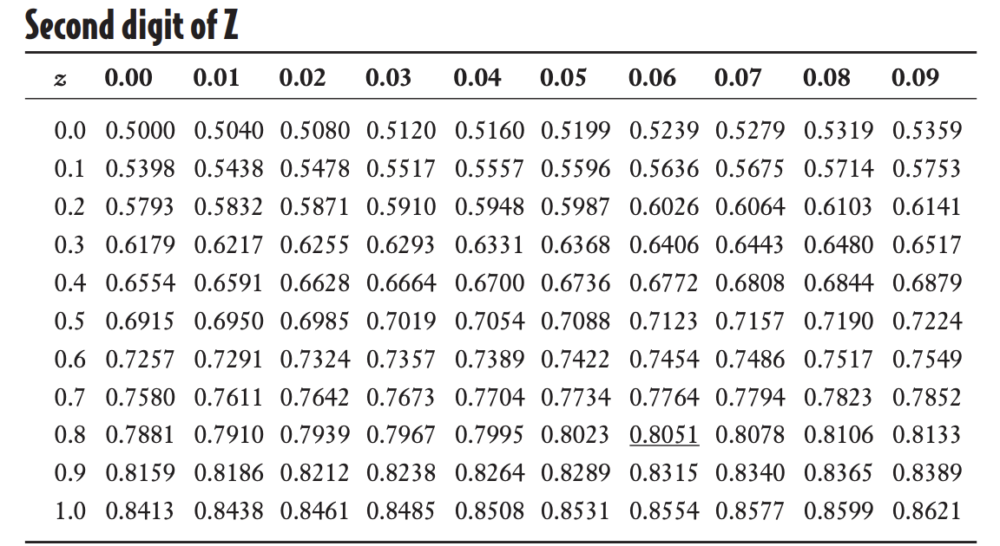

- Whats normal distribution?
- When the distribtuion is skewed to the right, whats the order of the mean, mode, and median is? What about when its skewed to the left?
- whats the standard normal distribution?
- Whats the purpose of standard normal distribution? What does it mean?
  - Are you converting the entire normal distribution or picking a normal value and converting it?
- What does it mean when you calculate Z really? its a way to convert the normal value to a .... normal value to the ... distribution?
-  What does the z score standard tells you in terms of the mean and standard deviation?
   -  is it from the mean and std of the standard normal distribution or the original distribution?
   -  How can you then use this information?
-  What does the standard normal table tells you? 
-  What do you do if you want to find the probability of bigger than a specific normal value?
-  Does the probability form the z value tells you less than or bigger than? how can you know the probability of bigger than if it tells you less than?
- What does a negative z score tells you?