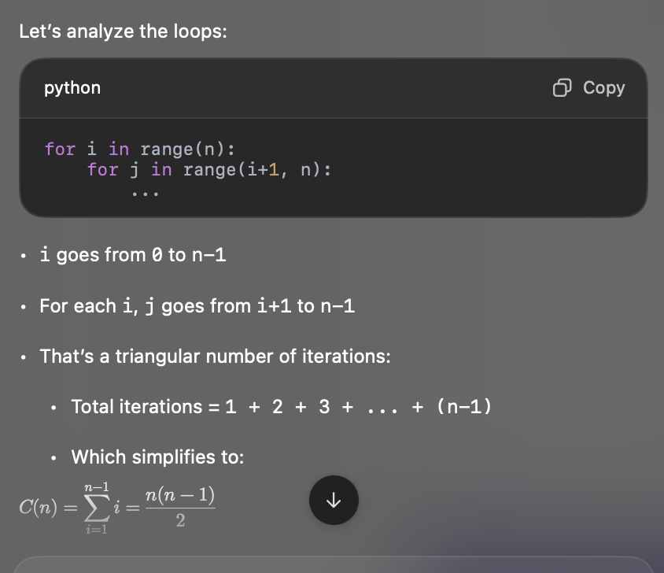

# Basic Concepts
- Whats recursion?
- Whats base case?
- Whats recursive case?

# Non-Recursive algorithms time complexity calculations

- What are the four steps to measure a non recursive algorithm? 
- What are the summation rules? 
- Explain the following example: 

- When you have two loops, do you count the number of iterations of the outer loop, the inner or both or what exactly?

# Recursive algorithms time complexity calculations
- Does recursion must have a termination condition?
- What are the steps to determine the time complexity of a recursive algorithm?
- How do you do backward subsitution? 
- 