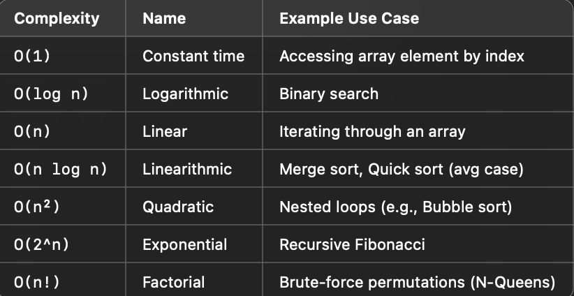
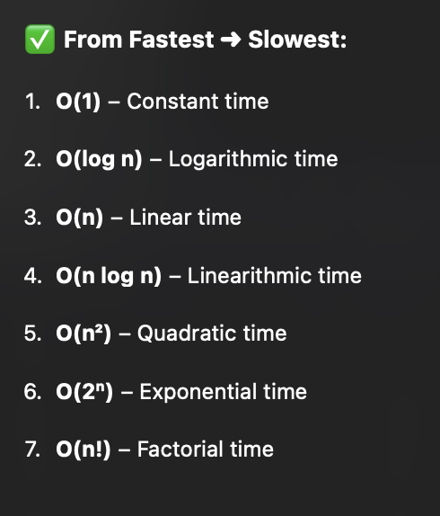
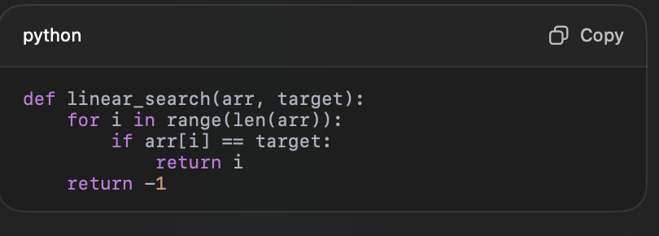

# Time Complexity
- Whats time complexity?
- What are basic operations? give me the different types out there?
- How do you find the time complexity theoritcally? approximation if you can calculate the time that takes for a basic operation to be performed?
- What is asymptotic complexity means? for example, if you say the algorithm have a O(n^2) time complexity, what does this means really?
- Whats C(n) calculates really?

# Big O
- Whats big O notation?
- Descrobe all the big O notation possibilites here: 
  - When does code lead to each of the following cases in the image?
  - O(1) is when the number of operations doesnt depend on?
  - O(logn) is when you "..." the input each time in the operations?
  - O(n) is when you go through "....."?
  - O(nlogn) is when you do what and what to the input?
  - O(n^2) is when you have "..."?
  - O(2^n) is when you do "bra..." and have "recu..."
  - O(n!) is when you generate all "possi..." for each "in..."?
- Give me the big O notations from slowest to fastest: 
- Whats the difference between Big O, Big Omega and Big theta?

# Best, Average and Worst
- Whats best, worst and average cases? 
- What are the questions that you need to ask to find the best, worst and average cases? (or the single question)
- Find the best, average and worst cases for the following example: 

# Space Complexity
- Whats space complexity?
- Whats the difference between space and time complexity? What does time complexity and space complexity focuses on?
- tell me the factors that tells me how to know the time complexity and how to know space complexity?
