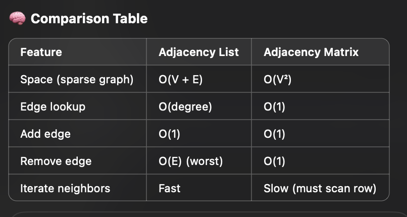

Graphs can be represented in two main ways: **Adjacency List** and **Adjacency Matrix**. Each has different trade-offs in terms of **space** and **time efficiency**.

---

# 🔹 1. Adjacency List

- Each vertex stores a list of **connected vertices**.
- Efficient for **sparse graphs** (few edges).
- Easy to iterate over neighbors.

## ✅ Example (Undirected):
```python
graph = {
    'A': ['B', 'C'],
    'B': ['A', 'D'],
    'C': ['A'],
    'D': ['B']
}
```
## Space Complexity
O(V + E)

---

# 🔹 2. Adjacency Matrix

Suppose we have an undirected graph with nodes: A, B, C  
And edges: A-B, A-C

We can number the nodes:
- A → 0
- B → 1
- C → 2

## Matrix:
|     | A | B | C |
|-----|---|---|---|
| **A** | 0 | 1 | 1 |
| **B** | 1 | 0 | 0 |
| **C** | 1 | 0 | 0 |

## Python Representation:
```python
# A = 0, B = 1, C = 2
matrix = [
    [0, 1, 1],  # A
    [1, 0, 0],  # B
    [1, 0, 0]   # C
]
```

## Space Complexity
O(V²)


# Comparison Table for operations to both
