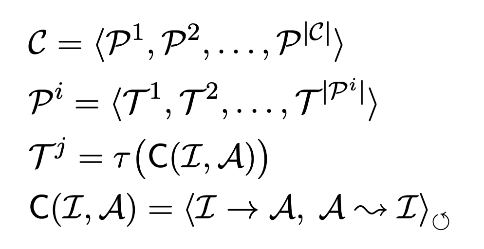
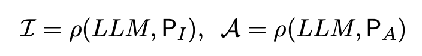
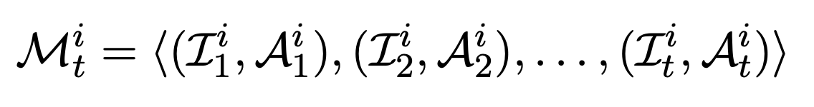
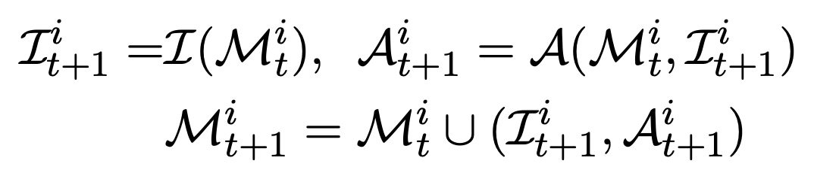
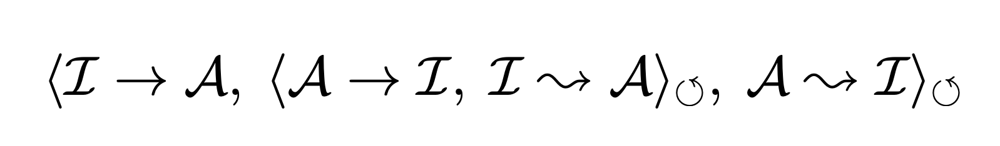

- context aware memory
- multi step planning

Further investigations reveal that natural-language communications contribute to comprehensive system design, while programming-language communications drive software optimization

We built a comprehensive dataset containing software requirement descriptions and conducted comprehensive analyses

In addition, to alleviate unexpected hallucinations, a communicative pattern named communicative dehallucination is devised, wherein agents
request more detailed information before responding directly and then continue the next round of
communication based on these details.

